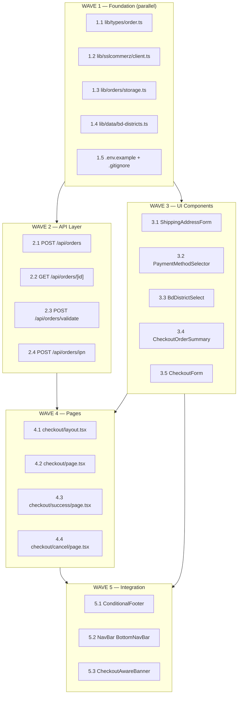

# Checkout Implementation Plan

**Date:** 2026-05-22
**Project:** ten-ml-perfume (Next.js 16 + React 19 + Tailwind v4 + shadcn/ui radix-lyra)
**Author:** Sisyphus

---

## Requirements (Confirmed with User)

| Requirement | Decision |
|-------------|----------|
| Payment gateway | **SSLCommerz** (real, sandbox mode) + Cash on Delivery |
| Checkout UX | **Single-page** split layout (form left, order summary right) |
| Auth | **Guest checkout** — no login required |
| Shipping fields | Full Name, Phone, Email, District, Area, Street Address, Order Notes |
| Checkout layout | **Clean** — hide announcement banner, hide footer |
| Order storage | **Minimal API + JSON files** in `data/orders/` |
| Currency | BDT (TakaFormatter exists) |
| Buy Now button | **Skip** — focus on cart→checkout flow only |

---

## Architecture Overview

```
                          WAVE 1 (parallel)
      ┌─────────┬──────────┬──────────┬──────────────┐
      │ Types   │ SSLCommerz│ Order    │ BD District │ Env +
      │ order.ts│ Client    │ Storage   │ Data       │ .gitignore
      └────┬────┴────┬─────┴────┬─────┴──────┬──────┘
           │         │          │            │
      ┌────▼─────────▼──────────▼────────────▼──────┐
      │            WAVE 2 - API Layer               │
      │  POST /api/orders  │  GET /api/orders/[id]  │
      │  POST /api/orders/validate                  │
      │  POST /api/orders/ipn (webhook)             │
      └─────────────────────┬────────────────────────┘
                            │
      ┌─────────────────────▼────────────────────────┐
      │     WAVE 3 - UI Components (parallel)        │
      │  ShippingAddrForm │ PaymentMethodSelector    │
      │  BdDistrictSelect │ CheckoutOrderSummary     │
      │  CheckoutForm (orchestrator)                 │
      └─────────────────────┬────────────────────────┘
                            │
      ┌─────────────────────▼────────────────────────┐
      │       WAVE 4 - Pages (parallel)              │
      │  checkout/page   │  checkout/success/page    │
      │  checkout/layout │  checkout/cancel/page     │
      └─────────────────────┬────────────────────────┘
                            │
      ┌─────────────────────▼────────────────────────┐
      │    WAVE 5 - Integration (parallel)           │
      │  ConditionalFooter │ NavBar │ CheckoutAware  │
      │  (/checkout hide)  │ (hide  │ Banner (hide   │
      │                    │ bottom)│ on checkout)   │
      └──────────────────────────────────────────────┘
```

---

## SSLCommerz Integration Flow

```
Checkout Form → POST /api/orders
  ├── COD: order saved → redirect to /checkout/success?order_id=X
  └── Online: order saved → initiate SSLCommerz session
                → SSLCommerz returns GatewayPageURL
                → browser redirects to SSLCommerz payment page
                → user pays (bKash, Nagad, card, etc.)
                → SSLCommerz redirects back to our site
                → /checkout/success?order_id=X&val_id=Y
                → success page validates transaction via API
                → shows order confirmation
                
  Cancel: user cancels on SSLCommerz page
                → redirects to /checkout/cancel?order_id=X
```

---

## WAVE 1 — Foundation (all items can run in parallel)

### 1.1 Order Types — `lib/types/order.ts`

```typescript
export type OrderStatus = "pending" | "processing" | "completed" | "failed" | "cancelled"
export type PaymentMethod = "sslcommerz" | "cod"
export type PaymentStatus = "pending" | "paid" | "failed" | "refunded"

export interface ShippingAddress {
  fullName: string
  phoneNumber: string
  email: string
  district: string
  area: string
  streetAddress: string
  orderNotes?: string
}

export interface OrderItem {
  productId: string | number
  name: string
  imageUrl: string
  ml: number
  price: number
  quantity: number
}

export interface Order {
  id: string
  tranId: string
  status: OrderStatus
  paymentMethod: PaymentMethod
  paymentStatus: PaymentStatus
  shippingAddress: ShippingAddress
  items: OrderItem[]
  subtotal: number
  shipping: number
  total: number
  sslczSessionKey?: string
  sslczValId?: string
  sslczTransactionId?: string
  createdAt: string
  updatedAt: string
}

export interface CreateOrderRequest {
  paymentMethod: PaymentMethod
  shippingAddress: ShippingAddress
  items: OrderItem[]
}

export interface CreateOrderResponse {
  success: boolean
  orderId?: string
  gatewayUrl?: string
  error?: string
}
```

### 1.2 SSLCommerz Client — `lib/sslcommerz/client.ts`

Server-side only. Uses native `fetch()` + `URLSearchParams`. No npm dependency.

**Functions:**
- `initiateSSLSession(params)` — POST to `https://sandbox.sslcommerz.com/gwprocess/v4/api.php` (or live)
- `validateSSLTransaction(valId)` — GET to `https://sandbox.sslcommerz.com/validator/api/validationserverAPI.php`

**Env vars:**
```
SSLCZ_STORE_ID=testbox      # sandbox default
SSLCZ_STORE_PASSWD=qwerty   # sandbox default
SSLCZ_IS_SANDBOX=true
NEXT_PUBLIC_APP_URL=http://localhost:3000
```

### 1.3 Order Storage — `lib/orders/storage.ts`

JSON file CRUD in `data/orders/` directory.

**Functions:**
- `saveOrder(order)` — writes `data/orders/{id}.json`
- `getOrder(id)` — reads single order
- `updateOrder(id, updates)` — partial update
- `listOrders()` — list all (sorted by creation date desc)

### 1.4 BD District Data — `lib/data/bd-districts.ts`

Hardcoded TypeScript data: 8 divisions, all 64 districts, major areas (3-10 per district).

### 1.5 Config Files

- `.env.example` — SSLCommerz vars + NEXT_PUBLIC_APP_URL
- `.gitignore` — add `data/orders/`

---

## WAVE 2 — API Layer (depends on Wave 1 types + libs)

### 2.1 POST /api/orders — `app/api/orders/route.ts`

**Flow:**
1. Validate request body (payment method, shipping address, cart items)
2. Generate order ID (nanoid) + transaction ID (`TENML-{timestamp}-{nanoid}`)
3. Calculate totals (reuse cart page logic: free shipping ≥ 2000 BDT)
4. Save order JSON
5. If COD: return `{ success: true, orderId }`
6. If online: call `initiateSSLSession()` with customer + amount data
7. On SSLCommerz success: return `{ success: true, orderId, gatewayUrl }`
8. On SSLCommerz failure: return error, update order status

### 2.2 GET /api/orders/[id] — `app/api/orders/[id]/route.ts`

Reads order from JSON storage. Returns 404 if not found.

### 2.3 POST /api/orders/validate — `app/api/orders/validate/route.ts`

Called from success page to validate SSLCommerz transaction server-side.

**Flow:**
1. Receive `orderId` + `valId`
2. Call `validateSSLTransaction(valId)` with SSLCommerz
3. Verify status is "VALID" or "VALIDATED"
4. Verify amount matches order total
5. Update order status to "completed" + paymentStatus to "paid"
6. Return updated order

### 2.4 POST /api/orders/ipn — `app/api/orders/ipn/route.ts`

SSLCommerz Instant Payment Notification webhook (form-data POST).
Always returns 200 (SSLCommerz requirement).

---

## WAVE 3 — UI Components (depends on Wave 1 types)

### 3.1 ShippingAddressForm — `components/storefront/checkout/ShippingAddressForm.tsx`

Client component. Controlled form with all shipping fields.

**Layout:**
- Grid: `grid-cols-1 md:grid-cols-2`
- Row 1: Full Name | Phone Number
- Row 2: Email (full width)
- Row 3: BdDistrictSelect (division → district → area)
- Row 4: Street Address (textarea)
- Row 5: Order Notes (optional textarea)

**Validation:**
- Required: name, phone, email, district, area, street address
- Phone: `/^01\d{9}$/` (BD format, 11 digits)
- Email: must contain `@`
- Show inline errors below each field

### 3.2 PaymentMethodSelector — `components/storefront/checkout/PaymentMethodSelector.tsx`

Two card-style radio buttons side by side:
- **Pay Online** (SSLCommerz) — credit card, bKash, Nagad, etc.
- **Cash on Delivery** — pay when you receive

Styled with `cn()` conditional classes for selected state.

### 3.3 BdDistrictSelect — `components/storefront/checkout/BdDistrictSelect.tsx`

Three cascading `NativeSelect` dropdowns:
1. Division select → filters District options
2. District select → filters Area options
3. Area select (final value)

### 3.4 CheckoutOrderSummary — `components/storefront/checkout/CheckoutOrderSummary.tsx`

Sticky sidebar showing:
- Mini cart items (thumbnail, name, ML, qty, line total)
- Subtotal
- Shipping (free vs 200 BDT with progress bar)
- Total
- Place Order button (primary CTA at bottom of summary)

Mobile: collapsed collapsible at bottom (same pattern as cart page).

### 3.5 CheckoutForm — `components/storefront/checkout/CheckoutForm.tsx`

Orchestrator component. Manages:
- Shipping address state (`useState<ShippingAddress>`)
- Payment method state (`useState<PaymentMethod>`)
- Form validation
- Form submission → `POST /api/orders`
- Redirect logic (COD → `/checkout/success`, Online → SSLCommerz URL)
- Loading / submitting states
- Cart clearing on success

---

## WAVE 4 — Pages (depends on Wave 3 components)

### 4.1 Checkout Layout — `app/checkout/layout.tsx`

Minimal pass-through layout (structural wrapper, actual chrome hiding in Wave 5).

### 4.2 Checkout Page — `app/checkout/page.tsx`

```
"use client"
- mounted check (hydration guard)
- Empty cart → redirect / show CTA to shop
- Split layout: form left, summary right (lg:grid-cols-[1fr_400px])
- Mobile: single column, summary at bottom
```

### 4.3 Success Page — `app/checkout/success/page.tsx`

```
- Receives order_id + val_id from URL params
- Validates payment (if online) via POST /api/orders/validate
- Shows order confirmation with details:
  - CheckCircle icon
  - Order ID
  - Total paid
  - Payment method
  - Shipping address summary
- Loading state, error state, success state
- CTAs: Continue Shopping, Go Home
```

### 4.4 Cancel Page — `app/checkout/cancel/page.tsx`

```
Simple static page:
- XCircle icon
- "Payment Cancelled" message
- "No charges were made"
- CTAs: Try Again → /checkout, Back to Cart → /cart
```

---

## WAVE 5 — Integration (depends on Waves 2 + 4)

### 5.1 ConditionalFooter — `components/storefront/layout/ConditionalFooter.tsx`

Add `/checkout` to the route exclusion:
```typescript
if (pathname.startsWith("/cart") || pathname.startsWith("/checkout")) return null
```

### 5.2 BottomNavBar — `components/storefront/layout/NavBar.tsx`

Add `/checkout` to the BottomNavBar hide condition (same pattern as cart).

### 5.3 CheckoutAwareBanner — new component

Create `components/storefront/layout/CheckoutAwareBanner.tsx`:
```typescript
"use client"
import { usePathname } from "next/navigation"
// Returns null on /checkout routes
```

Update `AppShell.tsx` to use it instead of direct AnnouncementBanner.

---

## File Manifest

### New Files (16)

| # | File | Wave |
|---|------|------|
| 1 | `lib/types/order.ts` | 1 |
| 2 | `lib/sslcommerz/client.ts` | 1 |
| 3 | `lib/orders/storage.ts` | 1 |
| 4 | `lib/data/bd-districts.ts` | 1 |
| 5 | `.env.example` | 1 |
| 6 | `app/api/orders/route.ts` | 2 |
| 7 | `app/api/orders/[id]/route.ts` | 2 |
| 8 | `app/api/orders/validate/route.ts` | 2 |
| 9 | `app/api/orders/ipn/route.ts` | 2 |
| 10 | `components/storefront/checkout/ShippingAddressForm.tsx` | 3 |
| 11 | `components/storefront/checkout/PaymentMethodSelector.tsx` | 3 |
| 12 | `components/storefront/checkout/BdDistrictSelect.tsx` | 3 |
| 13 | `components/storefront/checkout/CheckoutOrderSummary.tsx` | 3 |
| 14 | `components/storefront/checkout/CheckoutForm.tsx` | 3 |
| 15 | `components/storefront/checkout/types.ts` | 3 |
| 16 | `app/checkout/layout.tsx` | 4 |
| 17 | `app/checkout/page.tsx` | 4 |
| 18 | `app/checkout/success/page.tsx` | 4 |
| 19 | `app/checkout/cancel/page.tsx` | 4 |
| 20 | `components/storefront/layout/CheckoutAwareBanner.tsx` | 5 |

### Modified Files (3)

| # | File | Change |
|---|------|--------|
| 1 | `.gitignore` | Add `data/orders/` |
| 2 | `components/storefront/layout/ConditionalFooter.tsx` | Add checkout route check |
| 3 | `components/storefront/layout/NavBar.tsx` | Add checkout route check for BottomNavBar |

---

## Codebase Conventions to Follow

- **No semicolons** — Prettier `semi: false`
- **Double quotes** — All strings
- **150 char width** — Don't break early
- **`cn()` for class merging** — `import { cn } from "@/lib/utils"`
- **`cva()` for variants** — UI primitives with variant/size combos
- **`data-slot` on component roots** — shadcn convention
- **Server by default** — `"use client"` only for interactivity
- **Phosphor icons** — Server: `@phosphor-icons/react/dist/ssr`, Client: `@phosphor-icons/react`
- **No barrel exports** — Direct file imports only
- **Mobile-first** — Base = mobile, `md:` = 768px, `lg:` = 1024px
- **Self-closing tags** — `<Component />`
- **Rounded-none aesthetic** — Sharp rectilinear look
- **Tailwind v4** — CSS-first, no tailwind.config.ts

---

## Design System Tokens

| Token | Value | Usage |
|-------|-------|-------|
| `bg-background` | oklch(1 0 0) / dark: oklch(0.145...) | Page backgrounds |
| `bg-card` | oklch(1 0 0) / dark: oklch(0.212...) | Card surfaces |
| `border-input` | oklch(0.922...) / dark: oklch(1 0 0 / 15%) | Form field borders |
| `text-muted-foreground` | oklch(0.542...) / dark: oklch(0.711...) | Labels, secondary text |
| `bg-primary` | oklch(0.212...) / dark: oklch(0.922...) | Primary buttons, active states |
| `--ease-ios-smooth` | Custom linear() curve | Form transitions |
| `--ease-ios-spring` | Custom linear() curve | Animated elements |

---

## Execution Order & Dependencies



**Parallel execution notes:**
- **Wave 1**: All 5 items parallel
- **Wave 2**: 2.1 + 2.2 parallel; 2.3 + 2.4 after 2.1
- **Wave 3**: 3.1→3.2→3.3 sequential (data dependency); 3.4 + 3.5 parallel after 3.1
- **Wave 4**: All 4 pages parallel
- **Wave 5**: All 3 integration changes parallel

---

## Verification Plan

After implementation, verify the following:

### API Tests (curl)
1. **POST /api/orders** (COD) — should return `{ success: true, orderId }`
2. **POST /api/orders** (Online) — should return `{ success: true, orderId, gatewayUrl }`
3. **POST /api/orders** (invalid data) — should return 400 with error
4. **GET /api/orders/:id** (existing) — should return order data
5. **GET /api/orders/:id** (non-existing) — should return 404

### UI Tests (Playwright)
1. **Checkout page** — renders form + order summary, empty cart state
2. **Form validation** — shows errors on empty submit
3. **Payment method toggle** — switches between COD and Online styles
4. **Success page** — shows order confirmation
5. **Cancel page** — shows cancellation message

### Integration
1. **Cart → Checkout flow** — items carry through correctly
2. **COD flow** — creates order, clears cart, redirects to success
3. **Online flow** — creates order, redirects to SSLCommerz gateway URL
4. **Footer hidden** — on `/checkout`, `/checkout/success`, `/checkout/cancel`
5. **Banner hidden** — on all checkout routes
6. **BottomNavBar hidden** — on all checkout routes

---

## AI-Slop Guardrails

| Don't | Do |
|-------|-----|
| Add order history page (scope creep) | Stop at cancel page |
| Create OrderService class with DI | Use plain functions |
| Over-validate (18 checks for 6 fields) | Required + phone/email format only |
| JSDoc every function | Document only public API |
| Import new UI primitives | Use existing 18 primitives |
| Install npm packages | Use native fetch() |
| Over-engineer animations | Use motion only for: section transitions, success entrance |
| Write tests (not requested) | Verification via curl + Playwright |
